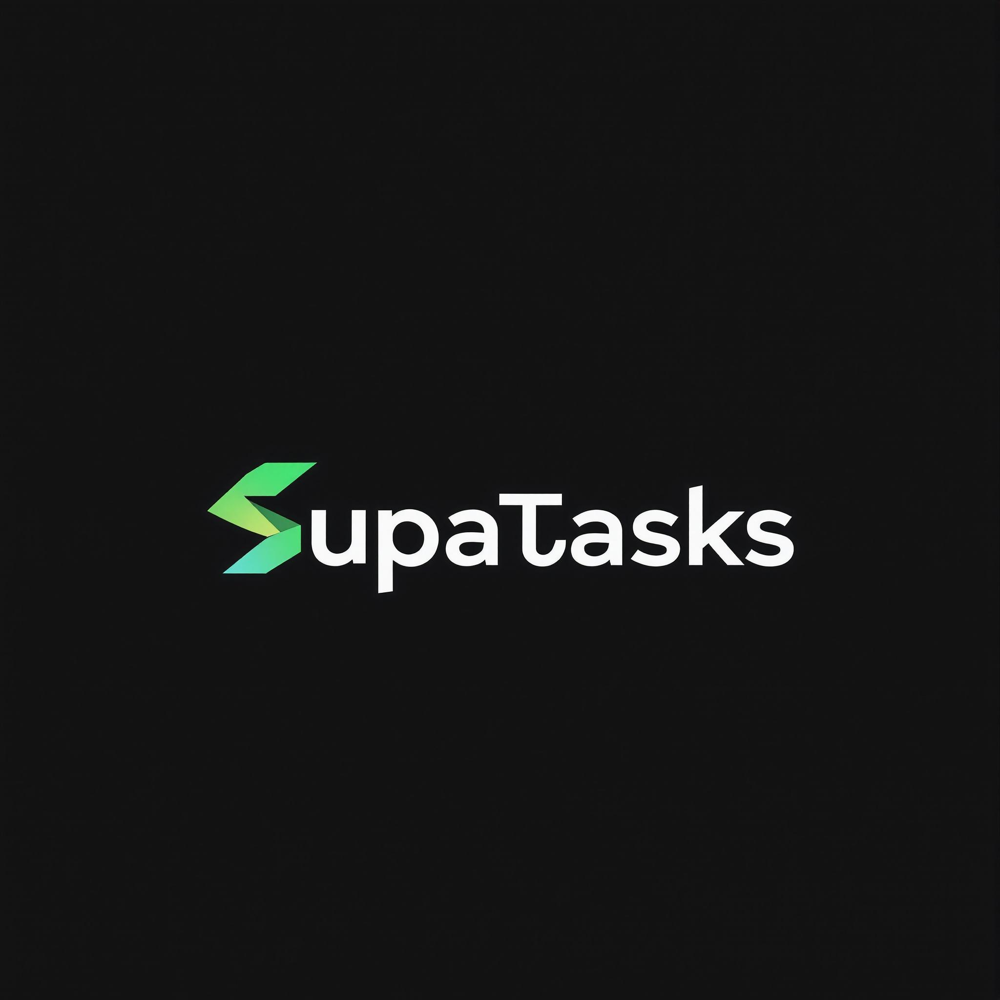
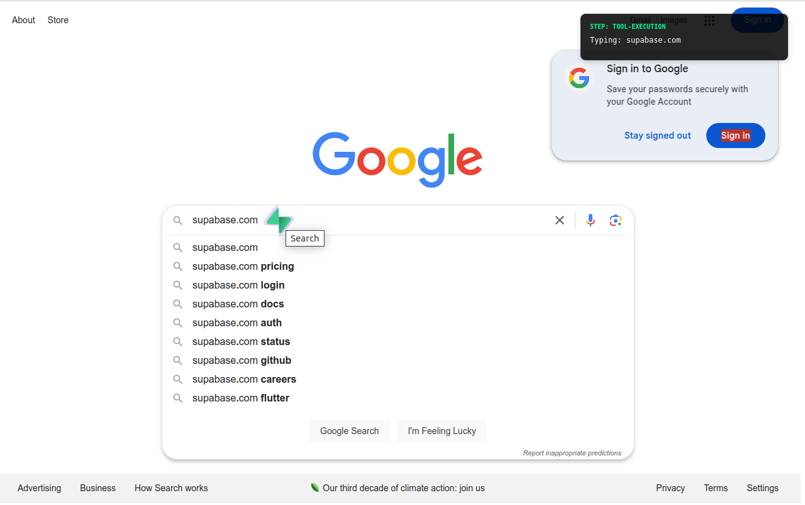
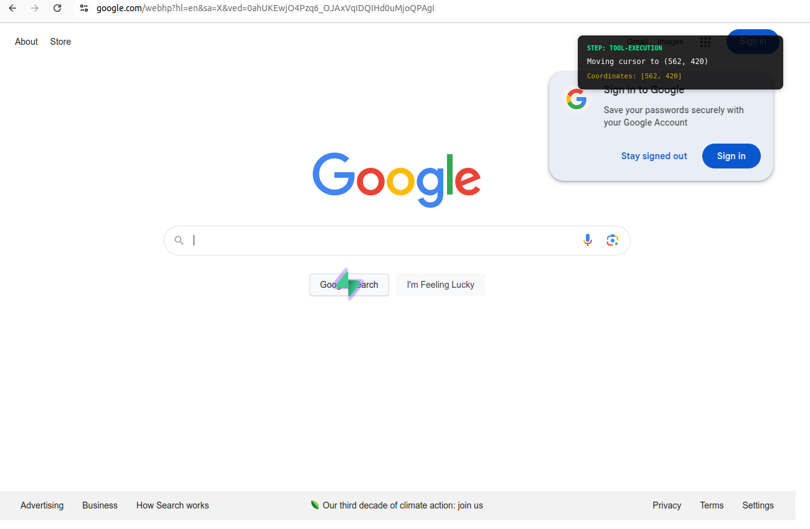
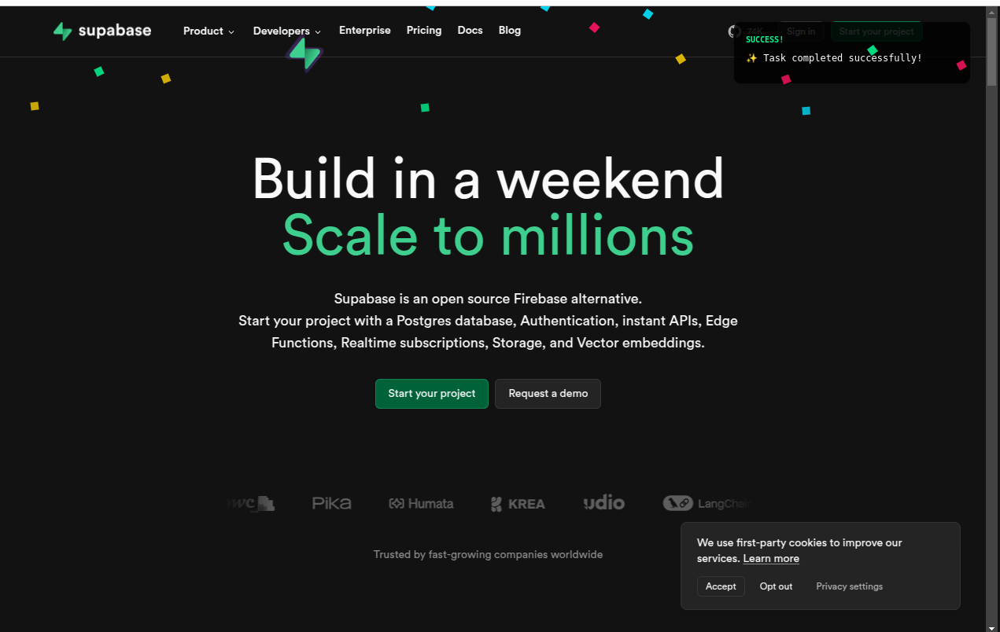

# SupaTask


**Automate Your To-Do List with AI**

SupaTask is your AI-powered task manager. Why spend time managing your to-do list when AI can do it for you? Built during the YC x Supabase Hackathon, SupaTask integrates smart automation with your daily productivity flow to keep you on track, effortlessly.

## 🚀 Overview
SupaTask leverages Supabase and AI capabilities to help you:
- **Automatically complete tasks** that don't need manual intervention.
- **Suggest task prioritization** based on your schedule and workload.
- **Provide reminders and updates** through an intelligent bot.

## 🔧️ Features
- **AI-Powered Task Management**: SupaTask can suggest, prioritize, and complete certain tasks automatically.
- **Integration with Supabase**: All tasks and data are securely stored and managed using Supabase's backend.
- **Effortless Productivity**: Spend less time organizing, and more time doing things that matter.

## 🖼️ Screenshots

*SupaTask navigating and performing tasks for you*

  
*Creating a task in SupaTask*

  
*Saving a new task*

  
*Task completed successfully*

## 📽 Demo
Check out the live demo: [Watch on Descript](https://share.descript.com/view/NB7j91921Gb)

## 🔧 Tech Stack
- **Frontend**: React.js
- **Backend**: Supabase (Postgres, Authentication, Realtime APIs)
- **AI Tools**: OpenAI GPT for intelligent task completion
- **Testing**: Vitest

## 🌟 How It Works
1. **User Adds Tasks**: Enter your tasks in the SupaTask dashboard.
2. **AI Takes Over**: The AI bot analyzes tasks to determine which can be completed or automated.
3. **Productivity Boost**: The bot executes or reminds you of tasks, while also providing prioritization suggestions.

## 🌚 Getting Started
### Prerequisites
- Node.js (v16 or higher)
- Supabase account
- Git

### Installation
1. **Clone the Repository**
   ```bash
   git clone https://github.com/MissioAI/supabase-yc-hackthon SupaTask
   cd SupaTask
   ```
2. **Install Dependencies**
   ```bash
   pnpm install
   ```
3. **Set Up Environment Variables**
   Create a `.env` file in the root folder and add your Supabase credentials:
   ```
   SUPABASE_URL=your_supabase_url
   SUPABASE_KEY=your_supabase_anon_key
   ```
4. **Run the Application**
   ```bash
   pnpm run dev
   ```
   The app will start on [localhost:3000](http://localhost:3000).

## 🤝 Contributing
Contributions are welcome! Please feel free to submit a Pull Request or open an Issue.

## 📜 License
This project is licensed under the MIT License - see the [LICENSE](LICENSE) file for details.

---
Built with ❤️ during the YC x Supabase Hackathon.

